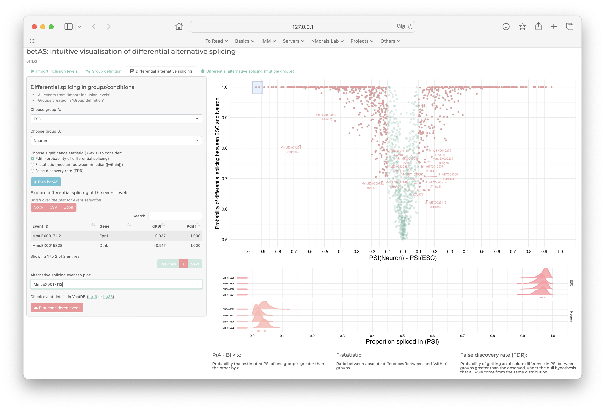

# betAS

<!-- badges: start -->
<!-- badges: end -->

**Please note that you are currently in the development branch.**
**This README file is under active maintenance**


> **Original article:** 
>
> Mariana Ascensão-Ferreira, Rita Martins-Silva, Nuno Saraiva-Agostinho and Nuno L. Barbosa-Morais (2023).
> [betAS: intuitive analysis and visualisation of differential alternative splicing using beta distributions]([url](https://www.biorxiv.org/content/10.1101/2022.12.26.521935v2)). *bioRxiv*


betAS is a user-friendly **R package** and **Shiny App** that allows intuitive analysis and
visualisation of differential alternative splicing (AS) based on
beta distributions. 

Beta distributions are suitable to quantify inclusion proportions of alternative sequences, 
using RNA sequencing reads supporting their inclusion and exclusion as surrogates for the two 
distribution shape parameters. Each beta distribution has the inclusion proportion as mean 
value and is narrower when the read coverage is higher, facilitating the interpretability of its 
precision when plotted. betAS uses beta distributions to accurately model PSI values and their precision, 
and to quantitatively and visually compare AS between groups of samples.

betAS allows the analysis of user-provided tables with AS quantifications, such as those obtained by ```vast-tools```, 
```rMATS``` or ```Whippet```, ranking differentially spliced events by a significance metric that incorporates the compromise 
between the uncertainty in individual sample estimates and the variability among replicates.




## Tutorials

The following tutorials are available:

* [Web app tutorial](https://www.youtube.com/watch?v=h6Xj1eIO5OU)
* [Command-line interface tutorial](https://diseasetranscriptomicslab.github.io/betAS/inst/betAS_tutorial.html)

## Installation

You can install the development version of betAS from [GitHub](https://github.com/) with:

``` r
# install.packages("devtools")
devtools::install_github("DiseaseTranscriptomicsLab/betAS@dev")
library(betAS)
```


## Feedback and support

Please send any feedback and questions on *betAS* to:

> Mariana Ascensão-Ferreira ([marianaascferreira@medicina.ulisboa.pt][email])
> 
> [Disease Transcriptomics Lab, Instituto de Medicina Molecular (Portugal)][NMorais]

[email]: mailto:marianaascferreira@medicina.ulisboa.pt
[NMorais]: http://imm.medicina.ulisboa.pt/group/distrans/


