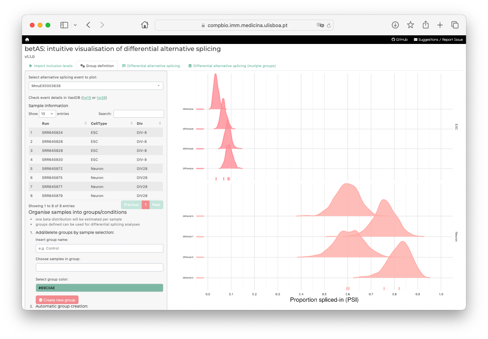

# betAS

<!-- badges: start -->
<!-- badges: end -->

**Please note that you are currently in the development branch.**
**This README file is under active maintenance**


> **Original article:** 
>
> Mariana Ascensão-Ferreira, Rita Martins-Silva, Nuno Saraiva-Agostinho and Nuno L. Barbosa-Morais (2023).
> [betAS: intuitive analysis and visualisation of differential alternative splicing using beta distributions]([url](https://www.biorxiv.org/content/10.1101/2022.12.26.521935v2)). *bioRxiv*


betAS is a user-friendly **App** and **R package** that allows intuitive analysis and
visualisation of differential alternative splicing (AS) based on
beta distributions. 

Beta distributions are suitable to quantify inclusion proportions of alternative sequences, 
using RNA sequencing reads supporting their inclusion and exclusion as surrogates for the two 
distribution shape parameters. Each beta distribution has the inclusion proportion as mean 
value and is narrower when the read coverage is higher, facilitating the interpretability of its 
precision when plotted. betAS uses beta distributions to accurately model PSI values and their precision, 
and to quantitatively and visually compare AS between groups of samples.

betAS allows the analysis of user-provided tables with AS quantifications, such as those obtained by ```vast-tools```, 
```rMATS``` or ```Whippet```, ranking differentially spliced events by a significance metric that incorporates the compromise 
between the uncertainty in individual sample estimates and the variability among replicates.


 

## Tutorials

The following tutorials are available:

* [Web app tutorial](https://www.youtube.com/watch?v=h6Xj1eIO5OU)
* [Command-line interface tutorial](https://diseasetranscriptomicslab.github.io/betAS/inst/betAS_tutorial.html)

## Get started

### Web App Hosting

betAS is freely available at <https://compbio.imm.medicina.ulisboa.pt/app/betAS>




### Installation

If you prefer to use `betAS` locally (as a Shiny app or as an R package), you can do so by following one of the following approaches:

#### A) R package

Install betAS R package from [GitHub](https://github.com/) with:

``` r
# install.packages("devtools")
devtools::install_github("DiseaseTranscriptomicsLab/betAS@dev")
library(betAS)
```

To explore the functionalities of `betAS` for analyzing differential alternative splicing, you now have the option to initiate the Shiny App using the command `betASapp()` or navigate through its functions. For the latter, you may find the [Command-line interface tutorial](https://diseasetranscriptomicslab.github.io/betAS/inst/betAS_tutorial.html) useful.


#### B) Docker image


1. Pull the latest version of the image from [DockerHub](https://hub.docker.com/r/marianaferreira/betas/tags), or specify a tag:

```bash
docker pull marianaferreira/betas:latest
```

2. Start RStudio Web from the Docker image:

```bash
docker run -e PASSWORD=bioc -p 8787:8787 marianaferreira/betas:latest
```

3. Go to RStudio Web via the web browser at https://localhost:8787

4. Log in RStudio with user `rstudio` and password `bioc`

5. Load betAS using `library(betAS)`

6. Start the visual interface of betAS with `betASapp()`


#### C) GitHub / R Studio 

1. Download the latest stable version of the repository from this link and unzip the files.
2. Open R Studio and run the script located at `R/betAS.R`. This action will launch the Shiny app.
3. If you wish to make changes, you can adapt the content of this script. For instance, the default input file size in `betAS` is configured to 100Mb. You have the flexibility to modify this value by adjusting the `shiny.maxRequestSize` parameter.


## Workflow

### 1) Load datasets from AS tools

betAS facilitates the visualization and analysis of data coming from three alternative splicing (AS) tools: [vast-tools](https://github.com/vastgroup/vast-tools), [rMATS](https://github.com/Xinglab/rmats-turbo), and [Whippet](https://github.com/timbitz/Whippet.jl). These specific tools were selected because their outputs consist of inclusion tables, providing counts for both inclusion and exclusion reads.

- vast-tools: `*INCLUSION_LEVELS_FULL*.tab` file.
- rMATS: `*MATS.JC.txt` file.
- Whippet: `*.psi.gz` files, with one file per sample.

For a clearer understanding, refer to the example below illustrating the expected formats of these files:

**vast-tools:**

Specifically, when using vast-tools, it's crucial to recognize that results from the `tidy` module or outputs from vast-tools `combine` are not compatible with betAS. This is because these outputs lack the necessary information regarding the counts of inclusion and exclusion reads.

| GENE  | EVENT         | COORD                             | LENGTH | FullCO                                                         | COMPLEX | SRR645824         | SRR645824.Q        | SRR645826         | SRR645826.Q        | SRR645828         | SRR645828.Q        | SRR645830         | SRR645830.Q        | SRR645872         | SRR645872.Q        | SRR645875         | SRR645875.Q        | SRR645877         | SRR645877.Q        | SRR645879         | SRR645879.Q        |
|-------|---------------|-----------------------------------|--------|----------------------------------------------------------------|---------|-------------------|---------------------|-------------------|---------------------|-------------------|---------------------|-------------------|---------------------|-------------------|---------------------|-------------------|---------------------|-------------------|---------------------|-------------------|---------------------| 
| Cdc45 | MmuEX6061348  | chr16:18795095-18795226           | 132    | chr16:18795825+18795831,18795095-18795226,18794860+18794874  | S       | 100               | SOK,SOK,92=102=0,OK,S@194.00,0.00  | 100               | SOK,SOK,102=102=0,OK,S@204.00,0.00 | 100               | SOK,SOK,94=98=0,OK,S@192.00,0.00  | 100               | SOK,SOK,75=70=0,OK,S@145.00,0.00 | 100               | N,N,1=2=0,OK,S@3.00,0.00   | 100               | N,N,2=3=0,OK,S@5.00,0.00   | 100               | N,N,2=1=0,OK,S@3.00,0.00   | 100               | N,N,1=2=0,OK,S@3.00,0.00   |
| Narf  | MmuEX0030885  | chr11:121250293-121250430         | 138    | chr11:121249192,121250293-121250430,121250760                | S       | 100               | OK,OK,19=30=0,OK,S@49.00,0.00    | 100               | OK,OK,26=18=0,OK,S@44.00,0.00   | 100               | OK,OK,26=19=0,OK,S@45.00,0.00   | 100               | OK,OK,20=20=0,OK,S@40.00,0.00   | 100               | SOK,SOK,66=68=0,OK,S@134.00,0.00 | 100               | SOK,SOK,66=54=0,OK,S@120.00,0.00 | 100               | SOK,SOK,73=70=0,OK,S@143.00,0.00 | 100               | SOK,SOK,90=63=0,OK,S@153.00,0.00 |
| Scmh1 | MmuEX0041239  | chr4:120524998-120525063          | 66     | chr4:120522649,120524998-120525063,120528156               | S       | 100               | VLOW,VLOW,9=13=0,OK,S@22.00,0.00 | 100               | LOW,LOW,13=15=0,OK,S@28.00,0.00 | 92.86             | VLOW,VLOW,12=14=1,OK,S@25.07,1.93 | 100               | VLOW,VLOW,12=7=0,OK,S@19.00,0.00 | 100               | LOW,LOW,12=24=0,OK,S@36.00,0.00 | 94.74             | LOW,LOW,17=19=1,OK,S@35.05,1.95 | 100               | OK,OK,15=24=0,OK,S@39.00,0.00   | 95.35             | LOW,LOW,27=14=1,OK,S@40.05,1.95 |
| Tfe3  | MmuEX0046712  | chrX:7767893-7767997             | 105    | chrX:7767684,7767893-7767997,7769430                      | S       | 93.62             | OK,OK,36=52=3,OK,S@85.19,5.81    | 89.36             | OK,OK,31=53=5,OK,S@79.53,9.47   | 92.16             | OK,OK,44=50=4,OK,S@90.32,7.68   | 87.34             | OK,OK,35=34=5,OK,S@64.63,9.37   | 81.4              | LOW,LOW,14=21=4,OK,S@31.75,7.25 | 100               | OK,OK,22=18=0,OK,S@40.00,0.00   | 94.74             | VLOW,VLOW,9=27=1,B1,S@35.05,1.95 | 90.24             | OK,OK,16=21=2,OK,S@35.19,3.81 |
| Axin2 | MmuEX0007157  | chr11:108942935-108943129        | 195    | chr11:108942696,108942935-108943129,108943656             | S       | 100               | N,N,6=8=0,OK,S@14.00,0.00     | 100               | N,N,1=8=0,B2,S@9.00,0.00    | 100               | N,N,2=13=0,B2,S@15.00,0.00   | 100               | LOW,LOW,11=16=0,OK,S@27.00,0.00 | 100               | N,N,4=4=0,OK,S@8.00,0.00    | 100               | N,N,3=5=0,OK,S@8.00,0.00    | 100               | N,N,5=4=0,OK,S@9.00,0.00    | 100               | N,N,4=8=0,OK,S@12.00,0.00   |

**rMATS:**

| ID | GeneID                 | geneSymbol | chr         | strand | exonStart_0base | exonEnd | upstreamES | upstreamEE | downstreamES | downstreamEE | ID.1 | IJC_SAMPLE_1          | SJC_SAMPLE_1          | IJC_SAMPLE_2          | SJC_SAMPLE_2          | IncFormLen | SkipFormLen | PValue            | FDR              | IncLevel1                | IncLevel2                | IncLevelDifference  |
|----|------------------------|------------|-------------|--------|-----------------|---------|-------------|------------|--------------|--------------|------|------------------------|------------------------|------------------------|------------------------|------------|-------------|-------------------|------------------|--------------------------|--------------------------|----------------------|
| 0  | ENSMUSG00000095041.7   | AC149090.1 | chrJH584304.1 | -      | 53535           | 54479   | 52189       | 52367      | 54720        | 54867        | 0    | 56,60,33,17            | 0,0,0,0                | 720,721,583,759       | 3,1,0,0                | 98         | 49          | 1                 | 1.0              | 1.0,1.0,1.0,1.0          | 0.992,0.997,1.0,1.0    | 0.003                |
| 1  | ENSMUSG00000095041.7   | AC149090.1 | chrJH584304.1 | -      | 53535           | 54479   | 52189       | 52367      | 55111        | 55701        | 1    | 18,13,13,3             | 0,0,0,0                | 237,239,217,257       | 0,0,0,1                | 98         | 49          | 1                 | 1.0              | 1.0,1.0,1.0,1.0          | 1.0,1.0,1.0,0.992    | 0.002                |
| 2  | ENSMUSG00000095041.7   | AC149090.1 | chrJH584304.1 | -      | 54720           | 54867   | 52189       | 52367      | 55111        | 55701        | 2    | 85,85,87,48            | 0,0,0,0                | 1265,1231,1084,1299   | 0,0,0,1                | 98         | 49          | 1                 | 1.0              | 1.0,1.0,1.0,1.0          | 1.0,1.0,1.0,0.998    | 0                    |
| 3  | ENSMUSG00000095041.7   | AC149090.1 | chrJH584304.1 | -      | 54720           | 54867   | 53535       | 54479      | 55111        | 55701        | 3    | 123,132,107,63         | 0,0,0,1                | 1746,1714,1450,1804   | 1,2,0,3                | 98         | 49          | 1                 | 1.0              | 1.0,1.0,1.0,0.969        | 0.999,0.998,1.0,0.997 | -0.006               |
| 4  | ENSMUSG00000095041.7   | AC149090.1 | chrJH584304.1 | -      | 56985           | 57151   | 55111       | 55701      | 58563        | 58835        | 4    | 67,53,64,22            | 16,31,17,17           | 1011,950,879,1178    | 227,238,209,216      | 98         | 49          | 0.0151293862075   | 0.115879863089  | 0.677,0.461,0.653,0.393 | 0.69,0.666,0.678,0.732 | -0

**Whippet:**

| Gene                 | Node | Coord                       | Strand | Type | Psi | CI_Width | CI_Lo,Hi        | Total_Reads | Complexity | Entropy | Inc_Paths | Exc_Paths | Edges    |
|----------------------|------|-----------------------------|--------|------|-----|----------|-----------------|-------------|-------------|---------|-----------|-----------|----------|
| ENSMUSG00000048960.13| 1    | chr1:10993465-10993517      | +      | TS   | 1   | 0.514    | 0.473,0.987     | 3           | K1          | 0       | 2:1.0     | NA        | NA       |
| ENSMUSG00000048960.13| 2    | chr1:10993518-10993909      | +      | TS   | 0   | 0.5143   | 0.0127,0.527    | 3           | K1          | 0       | 1-2:0.0   | NA        | NA       |
| ENSMUSG00000048960.13| 3    | chr1:10993910-10996601      | +      | NA   | NA  | NA       | NA              | NA          | NA          | NA      | NA        | NA        | NA       |
| ENSMUSG00000048960.13| 4    | chr1:11061326-11061397      | +      | CE   | NA  | NA       | NA              | NA          | NA          | NA      | NA        | NA        | NA       |
| ENSMUSG00000048960.13| 5    | chr1:11065794-11065916      | +      | CE   | NA  | NA       | NA              | NA          | NA          | NA      | NA        | NA        | NA       |


### 2) Filter events and visualize PSI distributions 

betAS provides various approaches to filter alternative splicing events, allowing users to tailor their analysis based on specific criteria. These filters include:

- **Event Type Filtering:**
  - Filter the dataset based on alternative splicing event types. Their nomenclature is the same as the one used in the individual AS tools.

- **PSI Value Range Filtering:**
  - Specify a PSI value range to consider (e.g., PSI ∈ [0, 100]).

- **Minimum Supporting Reads Filtering:**
  - Filter events with less than a given number of supporting reads in at least one sample.
  - Supports filtering based on the sum of inclusion and exclusion reads.

After filtering, you can obtain an overview of PSIs in the samples being analyzed.
   

### 3) Perform differential AS analyses

#### 3.1) Between two groups

betAS approach for alternative splicing analyses takes into account two metrics for each alternative splicing event under analyses: the magnitude of the effect (𝚫PSI = PSIbetAS(group A) - PSIbetAS(group B)) and the statistical significance of such changes. For the latter, betAS introduces three approaches: probability of differential splicing (Pdiff), F-statistic or false discovery rate (FDR).

- **Pdiff**: This approach takes the two sets of random points per condition and calculates, for each AS event’s estimated ∆PSI, the proportion of differences between these that are greater than zero, which has the same interpretation as asking what proportion of beta distribution-emitted values for one condition are higher than those emitted for the other, thus reflecting the probability of differential AS of PSIbetAS(group A) being greater than PSIbetAS(group B).

- **F-statistic**: betAS also enables an ANOVA-like analysis of variance, comparing inter- and intra-group variabilities. For each event, within is considered the set of differences between each pair of samples that are part of the same group and between the set of differences between each pair of groups. The ratio of the median absolute values of between and within therefore provides an “F-like” statistic. This metric provides a compromise between the effect size of AS differences and their significance.

- **FDR**: Random generation of points from a beta distribution is used to estimate the null distribution’s PSI and its precision. Then, one point is randomly selected from each of the sample’s null distribution and, keeping the samples’ group assignment (i.e., which samples belong to each group), the ∆PSI between groups under the null hypothesis is calculated. The process is repeated many times (10 000 by default) and the FDR is the proportion of ∆PSI random simulations that are larger than (i.e., more extreme) or equal to the empirical ∆PSI.
 

#### 3.2) Between multiple groups

The differential AS approach implemented by betAS can be applied to multiple (i.e., more than two) groups in a novel ANOVA-inspired way that extends the Pdiff definition to the comparison of the differences between samples belonging to different biological conditions to those found between replicates.


## Feedback and support

Please send any feedback and questions on *betAS* to:

> Mariana Ascensão-Ferreira (marianaascferreira@medicina.ulisboa.pt)
>
> Rita Martins-Silva (rita.silva@medicina.ulisboa.pt)
> 

[Disease Transcriptomics Lab, Instituto de Medicina Molecular (Portugal)](http://imm.medicina.ulisboa.pt/group/distrans/)
 


